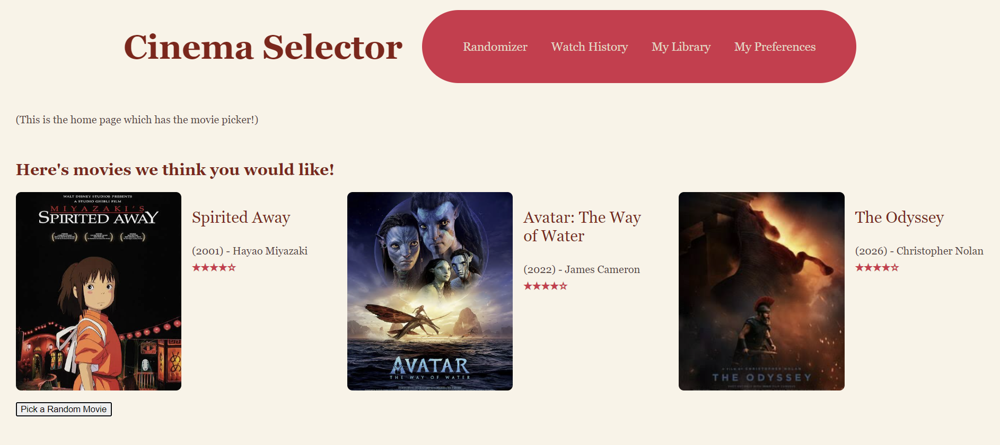
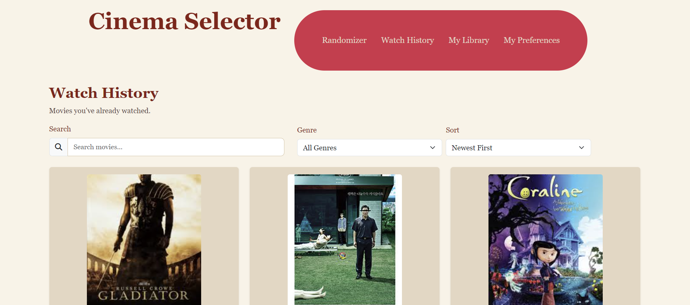
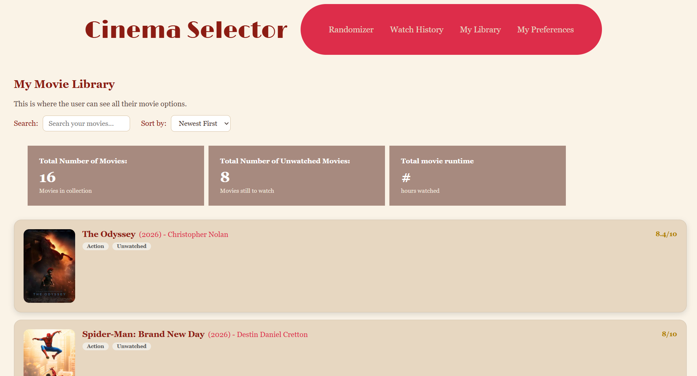
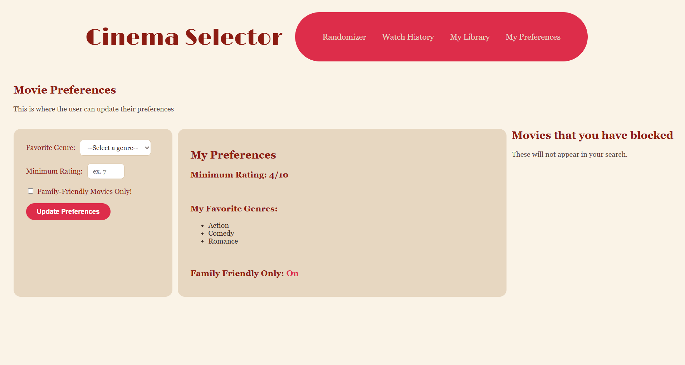

# Cinema_Selector
The Cinema Selector is a movie selector that uses your preferences and watching habits to pick the perfect movie for you.

Here is the link to the mock layouts from Google Stitch: https://stitch.withgoogle.com/projects/425297959112674698.

# Project Description & Intended Users  
Cinema Selector is a web app built for people who want to track a personal movie collection and struggle to decide what to watch. Rather than scrolling through a list, the app can randomly recommend a title from your library, keep a history of what you have already watched, and let you set viewing prefereneces (favorite genre, minimum rating, family-friendly filter) to tailor your future picks.

The intended users are individuals or households with a personal movie collection who want an easy way to pick something to watch and keep track of what they have seen.

# Running the Website Locally
This is currently a static front-end project, with no server or database required.
1) Download or clone the project folder, keeping all files in the same directory.
2) Open index.html directly in a web browser, or use a local dev server such as VS Code "Live Server" extension for auto-reload while editing.
3) Navigate between pages using the nav bar at the top of the site.

No installs, npm packages, or environment setups are needed at this stage yet.

# Screenshots

# Summary of Implemented Features
Randomizer (index.html):
- Displays 3 randomly selected movies from a movie inventory, each with poster, title, year, director, and star rating.
- JavaScript Functionality: clicking "Pick a Random Movie" reshuffles the inventory and re-renders 3 new picks without reloading the page.

Watch History (history.html):
- Displays movies marked as watched_true in the movie inventory.
- JavaScript Functionality: live search as you type by title, a genre filter dropdown, and a sort control (newest/oldest by watch date)... all three combine and render the results instantly on input, with no submit button required.
- Uses Bootstrap for layout/grid/cards and Font Awesome for the search icon.

My Library (library.html):
- Displays all of the movies in the current movie list.
- JavaScript Functionality: Live search as you type by title and director. You can sort by genre and newest to oldest. Sorting by rating is not currently set up yet. The results update on input, so there is no submit button needed.

My Preferences (preferences.html):
- Displays the user's current preferences as well as allows for the user to update them. This page will also show any movies the user might have blocked, however that has not been set up yet. 
- JavaScript Functionality: The user can update the minimum rating for movies they want recommened as well as their favorite genres. There are a few genres listed and a minimum rating for now. Family friendly mode is also displayed as on. Moving forward this toggle needs to be updated to interact with the users current preferences. These preferences currently do not affect the outcome of the random movie picker, but as we develop the random algorithm, these preferences will start to matter. 

Shared:
- Consistent nav bar and visual theme (style.css) across all four pages.

# Known Limitations and Unfinished Features
- No backend or database yet. All movie data is mock data hardocded in movies.js. A backend is planned but not yet implemented. Most likely using The Movie Database (TMDB) API.
- No user accounts or login. This would need to be updated to ensure individuals can see their own personal data on their movie account.
- No deployment yet. The site currently only runs locally by opening the HTML files directly.
- Preferences don't matter yet. Since we have not hooked anything up to a backend, the user preferences do not go anywhere at the moment.
